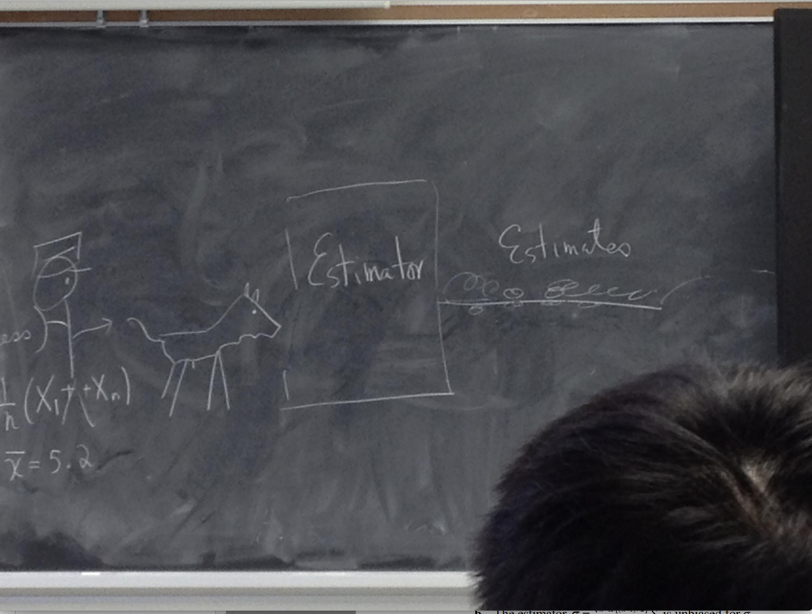

```{r xaringan-themer, include = FALSE}
library(xaringanthemer)
library(xaringanExtra)

mono_accent(base_color = "#5E5E5E") #3E8A83?
#options(htmltools.preserve.raw = FALSE)

# collapseoutput.js from https://gist.github.com/emitanaka/eaa258bb8471c041797ff377704c8505#file-collapseoutput-js
```

```{r xaringan-panelset, echo=FALSE}
xaringanExtra::use_panelset()
```

```{r, echo = FALSE}
knitr::opts_chunk$set(
  message = FALSE, warning = FALSE
)
```

```{r, include = FALSE}
library(tidyverse)
library(mosaic)

theme_set(theme_minimal() +
  theme(axis.title.x = element_text(size = 14, face = "bold"), 
        axis.title.y = element_text(size = 14, face = "bold"),
        axis.text.x = element_text(size = 12, face = "bold"), 
        axis.text.y = element_text(size = 12, face = "bold"), 
        plot.title = element_text(size = 16, face = "bold")))
```

<!--
pagedown::chrome_print("~/Dropbox/Teaching/03-Simmons Courses/STAT339-Statistical Theory/Slides/01-Estimation_Freq/01-Estimation_Freq.html")
-->

# Reminder!

**Personal and General Reflections on 50 years of Teaching Statistics** 

- Event for *Undergraduate Teaching Award*, Boston Chapter of the ASA

.pull-left[
```{r, echo = FALSE}

```
]

.pull-right[
🗓️Tuesday, January 25

⏱6-7pm ET

📍Register [here](https://www.eventbrite.com/e/reflections-on-50-years-of-teaching-statistics-teaching-award-event-tickets-203327898217)

💰**FREE** to attend

🙏Please go, if you can!
]

---

# Examples

1. **Clinical Trial**: What is the risk of major adverse cardiovascular events (MACE) for T2D patients while taking certain treatment regimens?
    - Estimating $p$, the *unknown* proportion of MACE for a large group of T2D patients taking a specific treatment

2. **Piéchart Emporium**: What is the average wait time at the checkout counter for PE customers?
    - Estimating $\mu$, the *unknown* average wait time for PE customers
    
3. **Cell Phone Batteries**: How can we best quantify battery life in a certain type of smart phone?
    - Estimating $\mu$, the *unknown* average battery life
    
--

**Considerations**: What is the *best* estimator? How do we determine what makes an estimator *best*?

---

# Estimators and Estimates

In general, we will refer to $\theta$ as the **target parameter** of interest. 

- Can be equal to $\mu$, $p$, $\sigma^{2}$, etc., but we'll use $\theta$ as a "catch-all". 

--

To *estimate* one (or more) parameters, we need **data**!

- For example, suppose the *average* wait time of a *random sample* of 20 PE customers was **five minutes**. 
    - This is a **point estimate** - it is an estimate of $\theta$ in the form of a *single value*. 
    
--

A **point estimator** (or *statistic*), $\hat{\theta}$, is the rule/formula used to calculate the value of an *estimate* based on *sample data*. 

**Examples**:

- $\bar{Y}=\frac{1}{n}\sum_{i=1}^{n}Y_{i}$

- $s=\sqrt{\frac{1}{n-1}\sum_{i=1}^{n}(Y_{i}-\bar{Y})^{2}}$

---

# Estimators and Estimates

.center[
```{r, echo = FALSE}

```
]

---

class: center, middle, frame

# Unbiased Estimation

---

# Bias of Point Estimators

Estimators are *not* perfect! Some are **good**, some are **bad**, and others are 💩💩💩

--

Let $\hat{\theta}$ be a point estimator for the parameter $\theta$. Then $\hat{\theta}$ is an **unbiased estimator** if $E(\hat{\theta})=\theta$. If $E(\hat{\theta})\neq\theta$, then $\hat{\theta}$ is *biased*. 

- The **bias** of a point estimator $\hat{\theta}$ is given by $Bias(\hat{\theta})=E(\hat{\theta})-\theta$.

--

Ideally, the expected value of our estimator $\hat{\theta}$ will equal the parameter ($\theta$) that we're trying to estimate. 

- But we also want $\hat{\theta}$ to have a **small variance** - this means a higher fraction of $\hat{\theta}$ values (in *repeated sampling*) will be *close* to $\theta$. 

---

# Two Unbiased Estimators

$Y_{1},Y_{2},Y_{3}\sim Exponential(2)$

- Suppose $\theta=E(Y_{i})=2$. let's try to *estimate* $\theta$ using different $\hat{\theta}$. 

.pull-left[
```{r, echo = FALSE, dpi = 300}
theta_1 = replicate(10000, {
  exp_samp = rexp(n = 3, rate = 1/2)
  exp_samp[1]
})

gf_density( ~ theta_1) + 
  geom_vline(xintercept = 2, color = "slateblue", size = 1.25) + 
  xlim(0, 15) + 
  labs(x = expression(hat(theta)[1]), title = expression(hat(theta)[1] == Y[1]))
```
]

.pull-right[
```{r, echo = FALSE, dpi = 300}
theta_2 = replicate(10000, {
  exp_samp = rexp(n = 3, rate = 1/2)
  mean(exp_samp)
})

gf_density( ~ theta_2) + 
  geom_vline(xintercept = 2, color = "slateblue", size = 1.25) + 
  xlim(0, 15) + 
  labs(x = expression(hat(theta)[2]), title = expression(hat(theta)[2] == bar(Y)))
```
]

---

# Mean Square Error (MSE)

The **mean square error (MSE)** of a point estimator is the *average of the square of the distance between the estimator and target parameter*: $$MSE(\hat{\theta})=E[(\hat{\theta}-\theta)^{2}]$$

It can be shown that $$MSE(\hat{\theta})=Var(\hat{\theta})+[Bias(\hat{\theta})]^{2}.$$

- In other words, $MSE(\hat{\theta})$ is a function of *both* the **variance** and **bias** of $\hat{\theta}$. 

**Note**: For *unbiased* estimators, $MSE(\hat{\theta})=Var(\hat{\theta})$. 

---

# Biased Estimators

If an estimator $\hat{\theta}$ is **biased** we can usually *correct* it to make it *unbiased*. 

--

<br>

**Example**

Suppose that $\hat{\theta}$ is an estimator for a parameter $\theta$ and $E(\hat{\theta})=a\theta+b$ for some nonzero constants $a$ and $b$. 

1. In terms of $a$, $b$, and $\theta$, what is $Bias(\hat{\theta})$?

2. Find a function of $\hat{\theta}$, say, $\hat{\theta}^{*}$, that is an unbiased estimator for $\theta$. 

3. Express $MSE(\hat{\theta}^{*})$ as a function of $Var(\hat{\theta})$. 

---

# Order Statistics as Estimators

Let $Y_{1},Y_{2},\dots,Y_{n}\sim Uniform(0,\theta)$, where the *target parameter* is $\theta$. 

- Because $\theta$ is the upper bound of the *support* for the $Y_{i}$, let's try to use $$Y_{(n)}=\max(Y_{1},Y_{2},\dots,Y_{n})$$ as an estimator for $\theta$. 

--

- Is $\hat{\theta}=Y_{(n)}$ *unbiased* for $\theta$?

**From STAT 338**: The PDF for $Y_{(n)}$ is $$g_{(n)}(y)=n[F(y)]^{n-1}f(y),$$ where $f(y)$ is the PDF for $Y$, and $F(y)=P(Y\leq y)$. 

---

```{r, echo = FALSE, eval = FALSE}
# Order Statistics as Estimators

Let $Y_{1},Y_{2},\dots,Y_{n}$ denote a random sample of size $n$ from a population whose density is given by $$f(y\mid\alpha)=3\alpha^{3}y^{-4},\quad \alpha\leq y,$$ where $\alpha>0$ is unknown. That is, $Y_{i}\sim Pareto(\alpha,\beta=3)$, where in general $$E(Y_{i})=\alpha\beta/(\beta-1)\quad\text{and}\quad Var(Y_{i})=\frac{\alpha^{2}\beta}{(\beta-1)^{2}(\beta-2)}.$$ 

Show that $\hat{\alpha}=Y_{(1)}=\min(Y_{1},Y_{2},\dots,Y_{n})$ is a *biased* estimator for $\alpha$. 

- **Note**: If $Y_{1},Y_{2},\dots,Y_{n}\sim iid\ Pareto(\alpha,\beta)$, then $$Y_{(1)}\sim Pareto(\alpha,n\beta).$$

---
```

# Common Unbiased Point Estimators

**Sample Mean**

Suppose $Y_{1},\dots,Y_{n}$ are a *random sample* from some population with mean $\mu$ and variance $\sigma^{2}$. 

- Our *target parameter* is $\theta=\mu$. Let's show that $\hat{\theta}=\bar{Y}$ is **unbiased**. 

--

**Sample Variance**

It turns out that $$S^{2*}=\frac{1}{n}\sum_{i=1}^{n}(Y_{i}-\bar{Y})^{2}$$ is **biased** for $\sigma^{2}$. 

- How can we find an **unbiased** estimator for $\sigma^{2}$? 🤔

---

```{r, echo = FALSE, eval = FALSE}
# Estimator for Binomial Variance

If $Y$ has a binomial distribution with parameters $n$ and $p$, then we can use $\hat{p}=Y/n$ as an unbiased estimator for $p$. 

To estimate the *variance* of $Y$, where $Var(Y)=np(1-p)$, we generally use $$\widehat{Var}(Y)=n\hat{p}\left(1-\hat{p}\right).$$

1. Show that the suggested estimator is a *biased* estimator of $Var(Y)$. 

2. Modify $n\hat{p}\left(1-\hat{p}\right)$ slightly to form an *unbiased* estimator of $Var(Y)$. 

---
```

# Bias/Variance Trade-off

While **unbiased** estimators sound *desirable*, they are not always the *best* estimators. 

In general, we'd like for $Bias(\hat{\theta})$ to be close to zero. But we also want $Var(\hat{\theta})$ to be close to zero!

- Higher variance means that estimates might be *very different* across **repeated samples**. 

- Ideally, $MSE(\hat{\theta})$ will be *as small as possible*. 

--

.center[
```{r, echo = FALSE, dpi = 300, fig.height = 4, fig.width = 6, out.width = "55%"}
theta_1 = replicate(10000, {
  2*mean(runif(100))
})

theta_2 = replicate(10000, {
  max(runif(100))
})

data = data.frame(theta = c(theta_1, theta_2), 
                  estimator = c(rep(1, 10000), rep(2, 10000)))

gf_density( ~ theta, fill = ~ factor(estimator), data = data) + 
  geom_vline(xintercept = 1, linetype = "dashed") + 
  labs(fill = "Estimator", x = expression(hat(theta)), 
       title = expression(theta == 1))
```

]

---

# Bias/Variance Trade-off

$Y_{1},Y_{2},\dots,Y_{n}\sim iid\ Uniform(0,\theta)$. 

Consider three estimators for $\theta$:

1. $\hat{\theta}_{1}=2\bar{Y}$

2. $\hat{\theta}_{2}=Y_{(n)}$. 

3. $\hat{\theta}_{3}=2Y_{1}$.

Let's find the bias and variance for each. 


---

class: center, middle, frame

# Methods of Estimation

## The Method of Moments

---

# Finding Estimators

Up to this point, we've mostly used *intuition* to find estimators $\hat{\theta}$ of $\theta$. 

- The **sample mean**, $\bar{Y}$, *seems* like it would be a good estimator for the **population mean**, $\mu$. 

- The **sample variance**, $s^{2}$, *seems* like it would be a good estimator for the **population variance**, $\sigma^{2}$. 

--

But what if we wanted to find estimators for the $\alpha$ and $\beta$ parameters, using a sample of observations from the $Gamma(\alpha,\beta)$ distribution?

- $E(Y)=\alpha\beta$, but we want to find estimators for *each* of $\alpha$ and $\beta$!

--

**Two estimation techniques**

1. *Method of Moments*

2. *Method of Maximum Likelihood*

---

# Method of Moments

**Recall**: The $k$th moment of a random variable $Y$ is $$\mu_{k}^{'}=E(Y^{k})$$

- Therefore, $\mu_{1}^{'}=E(Y)$, $\mu_{2}^{'}=E(Y^{2})$, etc.

--

We define the $k$th **sample moment** as the average, $$m_{k}^{'}=\frac{1}{n}\sum_{i=1}^{n}Y_{i}^{k}.$$

--

<br>

**Method of Moments (MOM)**: Set $\mu_{k}^{'}=m_{k}^{'}$, for $k=1,2,\dots,t$ ($t=$ number of parameters to be estimated) and *solve* for the parameter(s) of interest. 

---

# Uniform MOM Estimator

Let $Y_{1},Y_{2},\dots,Y_{n}\sim iid\ Uniform(0,\theta)$. 

- $\mu_{1}^{'}=E(Y)=\theta/2$

- $m_{1}^{'}=\bar{Y}=\frac{1}{n}\sum_{i=1}^{n}Y_{i}$

---

# MOM Estimators for Gamma parameters

Let $Y_{1},Y_{2},\dots,Y_{n}\sim iid\ Gamma(\alpha,\beta)$, where $\alpha$ and $\beta$ are unknown. 

- Find the MOM estimators for $\alpha$ and $\beta$. 

--

- $\mu_{1}^{'}=E(Y)=\alpha\beta$. 
    - Set this equal to $\frac{1}{n}\sum_{i=1}^{n}Y_{i}=\bar{Y}$. 

- $\mu_{2}^{'}=E(Y^{2})=Var(Y)+[E(Y)]^{2}=\alpha\beta^{2}+\alpha^{2}\beta^{2}$. 
    - Set this equal to $\frac{1}{n}\sum_{i=1}^{n}Y_{i}^{2}$. 
    
We need to solve the system of equations for $\alpha$ and $\beta$. 

--

- $\tilde{\alpha}=\frac{n\bar{Y}^{2}}{\sum_{i=1}^{n}(Y_{i}-\bar{Y})^{2}}$

- $\tilde{\beta}=\frac{\bar{Y}}{\tilde{\alpha}}=\frac{\sum_{i=1}^{n}(Y_{i}-\bar{Y})^{2}}{n\bar{Y}}$

---

# MOM Estimators for Normal parameters

Suppose we have a random sample $Y_{1},Y_{2},\dots,Y_{n}\sim iid\ Normal(\mu,\sigma^{2})$. 

- Find the MOM estimators for $\mu$ and $\sigma^{2}$. 

--

- $\tilde{\mu}=\bar{X}$ $\implies$ **unbiased** for $\mu$! 

- $\tilde{\sigma}^{2}=\frac{1}{n}\sum_{i=1}^{n}(Y_{i}-\bar{Y})^{2}$ $\implies$ **biased** for $\sigma^{2}$

---

# Pros and Cons of MOM

**Benefits**

- Simple to use (just equate sample and population moments)

- Can be used to estimate multiple parameter families

--

<br>

**Limitations**

- Generate *biased* estimators in many cases

- Need the moments to exist! (Sorry, [Cauchy distribution](https://en.wikipedia.org/wiki/Cauchy_distribution)...)

- MLEs are typically *closer* to the target quantity...

---

class: center, middle, frame

# Methods of Estimation

## The Method of Maximum Likelihood

---

# Likelihood Function

**Setting**: $Y_{1},Y_{2},\dots,Y_{n}$ are *iid* from a distribution with parameter $\theta$ (which might be a single value or a *vector* of multiple parameters). 

- The **likelihood function**, $f(\mathbf{y}\mid \theta)$, gives the *likelihood* of observing our sample $$(Y_{1}=y_{1},Y_{2}=y_{2},\dots,Y_{n}=y_{n})$$ when the parameter is $\theta$. 
    - For simplicity, we define $\mathbf{y}=(y_{1},y_{2},\dots,y_{n})$.
    
--

**Example** (*Continuous* random sample)

\begin{align*}
  f(\mathbf{y}\mid \theta)&=f(y_{1},y_{2},\dots,y_{n}\mid \theta)\\
  &= f(y_{1}\mid\theta)\times f(y_{2}\mid \theta)\times \cdots\times f(y_{n}\mid \theta)
\end{align*}

**Note**: The likelihood function is sometimes written as $L(\mathbf{y}\mid \theta)$ or $L(\theta)$. 

---

# Maximum Likelihood Estimation

**Intuition**: Choose $\hat{\theta}$ as the estimate of $\theta$ that **maximizes** the likelihood function!

- In this context, $\hat{\theta}$ is called the **maximum likelihood estimator (MLE)**. 

--

<br>

**Example**: Moose's favorite toys

.pull-left[
This box came with 45 balls. Sadly, Moose lost most of them under furniture, and there are **four left**. 

- Some are *red*, and some are *yellow*, but we don't know *exactly* how many of each. 

- Moose really only cares about the **red** balls, so let's try to *estimate* how many are red!
]

.pull-right[
```{r, echo = FALSE, out.width = "75%"}
knitr::include_graphics("cat_ball_toys.jpg")
```
]

---

# Moose's Favorite Toys

We have four balls - some are **red**, and some are yellow. Let's try to estimate *how many red balls there are among the four remaining*. 

- I allow Moose to choose three of these balls *at random*. Suppose all three are red; yay!

- If our sample yields *three red balls*, what would be a good estimate of the total number of red balls remaining, $n_{r}$?

--

The parameter, $n_{r}$ can be *either* **3** or **4**. We know that Moose choose $Y=3$ red balls, so $n_{r}$ *cannot* equal 0, 1, or 2. 

- Let's find the *likelihood* of obtaining our sample, in two separate worlds: one with $n_{r}=3$, and one with $n_{r}=4$

--

$$P(Y=3\mid n_{r}=3)=\frac{\binom{3}{3}\binom{1}{0}}{\binom{4}{3}}=0.25$$

---

# Moose's Favorite Toys

We have four balls - some are **red**, and some are yellow. Let's try to estimate *how many red balls there are among the four remaining*. 

- I allow Moose to choose three of these balls *at random*. Suppose all three are red; yay!

- If our sample yields *three red balls*, what would be a good estimate of the total number of red balls remaining, $n_{r}$?

The parameter, $n_{r}$ can be *either* **3** or **4**. We know that Moose choose $Y=3$ red balls, so $n_{r}$ *cannot* equal 0, 1, or 2. 

- Let's find the *likelihood* of obtaining our sample, in two separate worlds: one with $n_{r}=3$, and one with $n_{r}=4$

$$P(Y=3\mid n_{r}=4)=\frac{\binom{4}{3}}{\binom{4}{3}}=1$$

--

Because $n_{r}=4$ *maximizes* the likelihood of the *observed sample*, our **MLE** of $n_{r}$ is $\hat{n}_{r}=4$. 

---

# Lifetimes of Electrical Components

Suppose the lifetimes of electrical components (in years), $Y$, are modeled from an exponential distribution. That is, $Y_{1},Y_{2},\dots,Y_{n}\sim Exponential(\theta)$. 

- We observe a sample of $n=5$ component lifetimes: $\mathbf{y}=(3,1.5,2,1.7,2.1)$. Let's find the MLE $\hat{\theta}_{MLE}$ for $\theta$ that *maximizes* the likelihood of this sample.  

--

**1**. *Write likelihood*: 

\begin{align*}
  L(\theta)&=f(\mathbf{y}\mid \theta)=f(y_{1}\mid\theta)\times\cdots\times f(y_{5}\mid\theta)\\
  &=\left(\frac{1}{\theta}\right)e^{-y_{1}/\theta}\times\cdots\times\left(\frac{1}{\theta}\right)e^{-y_{5}/\theta}\\
  &=\frac{1}{\theta^{5}}\exp\left(\frac{-\sum_{i=1}^{5}y_{i}}{\theta}\right)\\
  &=\frac{1}{\theta^{5}}\exp\left(\frac{-10.3}{\theta}\right)
\end{align*}

---

# Lifetimes of Electrical Components

Suppose the lifetimes of electrical components (in years), $Y$, are modeled from an exponential distribution. That is, $Y_{1},Y_{2},\dots,Y_{n}\sim Exponential(\theta)$. 

- We observe a sample of $n=5$ component lifetimes: $\mathbf{y}=(3,1.5,2,1.7,2.1)$. Let's find the MLE $\hat{\theta}_{MLE}$ for $\theta$ that *maximizes* the likelihood of this sample.  

**2**. *Take derivative of* **log-likelihood** with respect to $\theta$: 

- $\log L(\theta)=-5\log\theta -(10.3/\theta)$

- $\frac{d \log L(\theta)}{d\theta}=(-5/\theta)+(10.3/\theta^{2})$

---

# Lifetimes of Electrical Components

Suppose the lifetimes of electrical components (in years), $Y$, are modeled from an exponential distribution. That is, $Y_{1},Y_{2},\dots,Y_{n}\sim Exponential(\theta)$. 

- We observe a sample of $n=5$ component lifetimes: $\mathbf{y}=(3,1.5,2,1.7,2.1)$. Let's find the MLE $\hat{\theta}_{MLE}$ for $\theta$ that *maximizes* the likelihood of this sample.  

**3**. *Solve for* $\theta$: 

- $(-5/\theta)+(10.3/\theta^{2})=0\implies \theta=10.3/5=2.06$

Therefore, $\hat{\theta}_{MLE}=2.06$. Because the *data* $\mathbf{y}$ are *observed* here, 2.06 is a maximum likelihood **estimate** of $\theta$. 

--

**4**. (Bonus) Take second derivative of log-likelihood, make sure it is negative at $\theta=2.06$.

---

# Exponential Likelihood

.center[
```{r, echo = FALSE, dpi = 300, fig.height = 4, fig.width = 6}
exp_L = function(theta){
  (1/theta^5)*exp(-10.3/theta)
}

ggplot(data = data.frame(x = c(0, 10)), aes(x)) +
  stat_function(fun = exp_L) +
  geom_vline(xintercept = 2.06, linetype = "dashed", color = "slateblue", size = 1.25) + 
  labs(x = expression(theta), y = expression(paste(L,"(",theta,")")), 
       title = expression(paste("Likelihood function for Exp(", theta, ")")), 
       subtitle = expression(paste(n == 5, ", ", hat(theta)[MLE] == 2.06)))
```
]

---

# Normal Distribution MLEs

Suppose that $Y_{1},Y_{2},\dots,Y_{n}$ form a *random sample* from a $Normal(\mu,\sigma^{2})$ distribution.

- Find the MLEs of $\mu$ and $\sigma^{2}$. 

**Note**: $\theta=(\mu,\sigma^{2})$, so we need to take two different derivatives of $\log L(\theta)$. 

--

<br>

**Solution**

- $\hat{\mu}_{MLE}=\bar{Y}$

- $\hat{\sigma}^{2}_{MLE}=\frac{1}{n}\sum_{i=1}^{n}(Y_{i}-\bar{Y})^{2}$ (a **biased** estimator!)

---

# Uniform MLE

Suppose that $Y_{1},Y_{2},\dots,Y_{n}$ form a *random sample* from a $Uniform(0,\theta)$ distribution.

- Find the MLE of $\theta$. 

--

**1**. *Write likelihood*: 

\begin{align*}
  L(\theta)&=f(y_{1}\mid\theta)\times\cdots\times f(y_{n}\mid \theta)\\
  &=\frac{1}{\theta^{n}},\quad\text{if}\ \ 0\leq y_{i}\leq\theta
\end{align*}

- The first derivative of $L(\theta)$ does *not* equal zero for *any* $\theta>0$. 

- However, $1/\theta^{n}$ **increases** as $\theta$ *decreases*, so we want to select $\theta$ to be as small as possible in order to maximize the likelihood. 
    - *One constraint*: All of the $y_{i}$ values are between 0 and $\theta$. 
    - The *smallest value* of $\theta$ that satisfies this constraint is $Y_{(n)}=\max(Y_{1},\dots,Y_{n})$
    
--

Therefore, $\hat{\theta}_{MLE}=Y_{(n)}$.

---

# Pros and Cons of MLE

**Benefits**

- MLEs are *invariant*! This means that, if $\hat{\theta}$ is an MLE for $\theta$, then $g(\hat{\theta})$ is an MLE for $g(\theta)$. 

- MLEs are *consistent*. 

--

<br>

**Limitations**

- MLEs do not always exist.

- The MLE is **NOT** the most likely parameter, *given the data* ($E(\theta\mid Y)$). It estimates the parameter $\theta$ that maximizes the distribution of $Y\mid \theta$
    - In other words, the MLE gives the parameter estimate most likely to have produced the observed data. 

---

# Consistency of the MLE

The estimator $\hat{\theta}_{n}$ is said to be **consistent** for $\theta$ if, for any $\epsilon>0$, $$\lim_{n\to\infty}P(|\hat{\theta}_{n}-\theta|\leq \epsilon)=1.$$

- Basically, this means that if $n$ is **large enough**, there is a probability of 1 that $\hat{\theta}_{n}$ will be *very close to* $\theta$. 

--

```{r, echo = FALSE, fig.align='center', dpi = 300, fig.height = 4, fig.width = 6, out.width = "65%"}
theta_hat = rep(NA, 2000)

for(i in 1:2000){
  Y=runif(i, min = 0, max = 339)
  theta_hat[i] = max(Y)
}

gf_point(theta_hat ~ 1:2000) + 
  geom_line() +
  geom_hline(yintercept = 339, size = 1, 
             linetype = "dashed", color = "dodgerblue") + 
  labs(x = "Sample Size (n)", y = expression(paste(max, "(", Y[1],"...",Y[n],")")), 
       title = expression(paste(Y[i], " ~ iid Uniform(0, ", 339, ")")),
       subtitle = expression(paste(hat(theta)[MLE], " = " ,max, "(", Y[1],"...",Y[n],")")))
```

---

class: center, middle, frame

# Data Reduction: Sufficiency

---

# Sufficient Statistics

Most of the estimators we've chosen have *seemed* like they would be good estimators. 

- The sample mean, $\bar{Y}$, is *probably* a solid estimator for the population mean $\mu$.

Once we calculate $\bar{Y}$, the actual sample values $Y_{1},\dots,Y_{n}$ are *no longer important*; the information in the sample is *summarized* by $\bar{Y}$. 

- But does this summary retain all of the information about $\mu$ contained in the original $n$ observations?

--

A statistic that summarizes *all* information in a sample about a target parameter is said to be **sufficient**. 

- We'll use sufficient statistics to help determine *best* (unbiased) estimators. 

---

# Factorization Criterion

**Theorem**

Let $U$ be a statistic based on the random sample $Y_{1},\dots,Y_{n}$. Then $U$ is a **sufficient statistic** for the estimation of a parameter $\theta$ if and only if the likelihood $L(\theta)=f(y_{1},\dots,y_{n}\mid \theta)$ can be factored into two nonnegative functions: $$L(\theta)=g(u,\theta)\times h(y_{1},\dots,y_{n})$$ where: 

- $g(u,\theta)$ is a function *only* of $u$ and $\theta$, and

- $h(y_{1},\dots,y_{n})$ is *not* a function of $\theta$. 

--

**Process for Finding a Sufficient Statistic**

1. Write out the **likelihood**, $L(\theta)=f(y_{1}\mid\theta)\times\cdots\times f(y_{n}\mid \theta)$.

2. Given some statistic $U$, check if $L(\theta)$ can be broken down into $g(u,\theta)$ and $h(y_{1},\dots,y_{n})$. 
    - **Note**: There are often *more than one* sufficient statistic for any parameter. 
    
---

# Sufficient Statistic Examples

1. Let $Y_{1},Y_{2},\dots,Y_{n}$ be a random sample such that $Y_{i}\sim Exponential(\theta)$ with PDF $$f(y_{i}\mid\theta)=\frac{1}{\theta}e^{-y_{i}/\theta},\quad y_{i}>0.$$ Show that $U=\bar{Y}$ is a sufficient statistic for $\theta$. 

--

2. Let $Y_{1},Y_{2},\dots,Y_{n}$ be a random sample such that $Y_{i}\sim Beta(\theta,1)$ with PDF $$f(y_{i}\mid \theta)=\theta y^{\theta-1},\quad 0<y<1.$$ Show that $U=\prod_{i=1}^{n}Y_{i}=Y_{1}\times\cdots\times Y_{n}$ is a sufficient statistic for $\theta$. 

---

# Rao-Blackwell Theorem

Let $\hat{\theta}$ be an unbiased estimator for $\theta$ If $\hat{\theta}$ has a smaller variance than *all other unbiased estimators* for $\theta$, then $\hat{\theta}$ is the **best unbiased estimator (BUE)** (the "boo").

--

.pull-left[
```{r, echo = FALSE, dpi = 300}

```
]

--

.pull-right[
**Rao-Blackwell Theorem**

Let $h(U)$ be some function of a statistic, $U$. If:

- $U$ is a sufficient statistic for $\theta$

- $E[h(U)]=\theta$

then it follows that $\hat{\theta}=h(U)$ is the *best unbiased estimator* for $\theta$.
]

---


---

class: center, middle, frame

# Sampling Distributions of Estimators

---

# Recap

**What have we done so far?**⏳⏳⏳

We've used **point estimators** (or *statistics*), $\hat{\theta}$, to *estimate* unknown target **parameters**, $\theta$. 

- These estimators are functions of:
    - observable random variables in a sample
    - known constants (usually the sample size, *n*)
    
- While *unknown*, $\theta$ is assumed to be **fixed** at some value. 

--

Because statistics are *functions* of random variables... 

.center[
**All statistics are random variables**!
]

--

Because **all statistics are random variables**, all statistics have *probability distributions* that illustrate (among other things) how much they *vary from sample to sample*. 

- These "special" probability distributions are called **sampling distributions**. 

---

# Why sampling distributions?

**Before the sample has been taken**, we can use the *sampling distribution* of $\hat{\theta}$ to calculate the probability that $\hat{\theta}$ will be close to $\theta$. 

--

**Example** 

Let $Y_{1},Y_{2},\dots,Y_{n}\sim iid\ Normal(\mu,\sigma^{2})$. Then: $$\bar{Y}\sim Normal\left(\mu,\frac{\sigma^{2}}{n}\right).$$

--

.center[
```{r, echo = FALSE, fig.align='center', dpi = 300, fig.height = 4, fig.width = 6, out.width = "55%"}
ggplot(data = data.frame(x = c(-4, 4)), aes(x)) +
  stat_function(fun = dnorm, 
                args = list(mean = 0, sd = 1)) + 
  labs(x = expression(bar(Y)), y = "") +
  theme_minimal() +
  theme(axis.title.x = element_text(size = 14, face = "bold"), 
        axis.title.y = element_blank(),
        axis.text.x = element_blank(),
        axis.text.y = element_blank(),
        plot.title = element_text(size = 14, face = "bold"))
```

]
    
---

# Chi-Squared Distribution

Again, suppose that $Y_{1},Y_{2},\dots,Y_{n}\sim iid\ Normal(\mu,\sigma^{2})$. 

- Though *now* we want to work with the *sample variance*, $S^{2}$. 

1. **Unbiased Estimator**: $$S^{2}=\frac{1}{n-1}\sum_{i=1}^{n}(Y_{i}-\bar{Y})^{2}$$

2. **MLE (and MOM Estimator)**: $$\hat{\sigma}^{2}_{MLE}=\frac{1}{n}\sum_{i=1}^{n}(Y_{i}-\bar{Y})^{2}$$

It turns out that, except for a *scale factor*, the sample variance follows a $\chi^{2}$ (*chi-squared*) distribution with $n-1$ **degrees of freedom**. 

---

# Chi-Squared Distribution

**Theorem**

Let $Y_{1},Y_{2},\dots,Y_{n}$ be a random sample from a $Normal(\mu,\sigma^{2})$ distribution. Then $$\frac{(n-1)S^{2}}{\sigma^{2}}=\frac{\sum_{i=1}^{n}(Y_{i}-\bar{Y})^{2}}{\sigma^{2}}\sim \chi^{2}(n-1).$$

--

.pull-left[
```{r, echo = FALSE, dpi = 300}
ggplot(data = data.frame(x = c(0, 10)), aes(x)) +
  stat_function(fun = dchisq, 
                args = list(df = 3)) + 
  labs(x = expression(chi^2, y = ""), 
       title = expression(paste(chi^2,"(",df==3,") distribution")))
```
]

.pull-right[
```{r, echo = FALSE, dpi = 300}
ggplot(data = data.frame(x = c(0, 35)), aes(x)) +
  stat_function(fun = dchisq, 
                args = list(df = 10)) + 
  labs(x = expression(chi^2, y = ""), 
       title = expression(paste(chi^2,"(",df==10,") distribution")))
```
]

---

# Example

Suppose $Y_{1},Y_{2},\dots,Y_{10}\sim iid\ Normal(\mu,\sigma^{2}=4)$. 

- $\mu$ is *unknown*, and $\sigma^{2}$ is *known*. 

Because $n=10$ and $\sigma^{2}=4$, the *sampling distribution* $U=9S^{2}/4\sim\chi^{2}(df = 9)$. 

- Let's use this to find $P(S^{2}>3)$. 

--

.pull-left[
```{r, echo = FALSE, dpi = 300, out.width = "85%"}
ggplot(data = data.frame(x = c(0, 25)), aes(x)) +
  stat_function(fun = dchisq, 
                args = list(df = 9)) + 
  stat_function(fun = dchisq, 
                args = list(df = 9),
                xlim = c(6.75, 25),
                geom = "area", 
                fill = "slateblue") +
  labs(x = expression(U, y = ""), 
       title = expression(paste(chi^2,"(",df==9,") distribution")))
```
]

.pull-right[
$P(S^{2}>3)=P\left(\frac{9S^{2}}{4}>\frac{9\times3}{4}\right)=P(U>6.75)$ 

```{r}
1 - pchisq(6.75, df = 9)
```

]

---

# Student's t Distribution

When the population standard deviation, $\sigma$, is *unknown*, it can be estimated by $S=\sqrt{S^{2}}$, and the quantity $$T=\frac{\bar{Y}-\mu}{s/\sqrt{n}}$$ is used in certain procedures for inference about $\mu$. 

- This quantity, $T$, has a **t distribution** with $n-1$ degrees of freedom!

--

**Definition**: Let $Z$ be a **standard Normal** random variable, and let $W$ be a $\chi^{2}$-distributed random variable with $\nu$ degrees of freedom. Then, if $Z$ and $W$ are *independent*, $$T=\frac{Z}{\sqrt{W/\nu}}$$ is said to have a **t distribution** with $\nu$ degrees of freedom. 

---

# Student's t vs. Normal

.center[
```{r, echo = FALSE, dpi = 300, fig.height = 4, fig.width = 6}
ggplot(data = data.frame(x = c(-4, 4)), aes(x)) +
  stat_function(fun = dnorm, 
                args = list(mean = 0, sd = 1), 
                color = "hotpink") + 
  stat_function(fun = dt, 
                args = list(df = 5), 
                color = "slateblue") +
  labs(x = "", y = "", 
       title = "Pink: Normal(0, 1); Blue: t(df = 5)")
```
]

---

# F Distribution

Suppose now that we are comparing the variances from **two normal samples**:

- $X_{1},X_{2},\dots,X_{n}\sim N(\mu_{X},\sigma^{2}_{X})$

- $Y_{1},Y_{2},\dots,Y_{n}\sim N(\mu_{Y},\sigma^{2}_{Y})$

**Question**

Are the sample data consistent with the *assumption* that $\sigma^{2}_{X}=\sigma^{2}_{Y}$?

--

- We know that $S^{2}_{X}$ and $S^{2}_{Y}$ are unbiased estimators of $\sigma^{2}_{X}$ and $\sigma^{2}_{Y}$, respectively. 
    - Let's look at the *ratio*, $S_{X}^{2}/S_{Y}^{2}$. 
    
- It turns out that, if we divide each $S^{2}$ by its respective $\sigma^{2}$, then the ratio $$\frac{S_{X}^{2}/\sigma^{2}_{X}}{S_{Y}^{2}/\sigma^{2}_{Y}}\sim F(df_{1}=n_{X}-1, df_{2}=n_{Y}-1)$$

---

# F Distribution

**General Definition**

Let $W_{1}$ and $W_{2}$ be *independent* $\chi^{2}$-distributed random variables with $\nu_{1}$ and $\nu_{2}$ df, respectively. Then $$F=\frac{W_{1}/\nu_{1}}{W_{2}/\nu_{2}}\sim F(\nu_{1},\nu_{2}).$$

--

**Example**: Suppose...

- $X_{1},\dots,X_{21}\sim N(\mu_{X},\sigma^{2}_{X})$, $S_{X}^{2}=994.7$

- $Y_{1},\dots,Y_{15}\sim N(\mu_{Y},\sigma^{2}_{Y})$, $S_{Y}^{2}=250.3$

Is it reasonable to assume that $\sigma^{2}_{X}=\sigma^{2}_{Y}$?

--

**IF** $\sigma^{2}_{X}=\sigma^{2}_{Y}$, then $\frac{S^{2}_{X}}{S^{2}_{Y}}\sim F(20, 14)$: $$P(\frac{S^{2}_{X}}{S^{2}_{Y}}>\frac{994.7}{250.3})=P(F>3.97)=0.006$$

---

# Recap

We have developed **sampling distributions** of *statistics* calculated by using observations in random samples from **Normal** populations. 

If $Y_{1},\dots,Y_{n}\sim iid\ N(\mu,\sigma^{2})$, then...

1. $\sqrt{n}(\bar{Y}-\mu)/\sigma\sim N(0,1)$

2. $(n-1)S^{2}/\sigma^{2}\sim\chi^{2}(n-1)$

3. $\sqrt{n}(\bar{Y}-\mu)/S\sim t(n-1)$

4. $F=(S_{1}^{2}/\sigma_{1}^{2})/(S_{2}^{2}/\sigma_{2}^{2})\sim F(n_{1}-1,n_{2}-1)$, provided that the samples are *independent*. 

These sampling distributions will help us quite a bit later on with **confidence intervals** and **hypothesis tests**!

---

# Frequentist Estimation

This first unit of STAT 339 has been devoted to estimation from a **frequentist perspective**. 

- Frequentists view probability as a representation of a *long-run frequency* over a *large* (sometimes infinite) number of repetitions of an experiment. 
  
- The true value of a parameter, $\theta$, is **fixed** and **unknown**. 

--

In the next unit, we will focus on estimation from a **Bayesian perspective**. 

- Bayesians view probability as a representation of a *relative plausibility* of an event. 

- Parameters, $\theta$, are themselves treated as *random variables*, assigned some **prior distribution**. 
    - Gives weight to prior knowledge. 
    
--

While we will study various procedures through both *frequentist* and *Bayesian* lenses, these are **not** competing!

- Both perspectives aim to learn from data, both use data to fit models, evaluate hypotheses, etc.