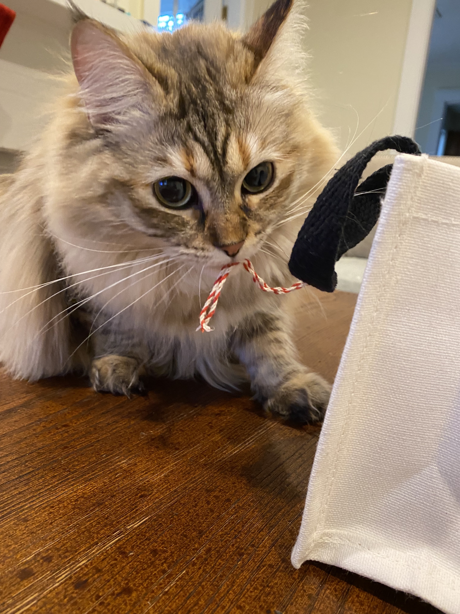
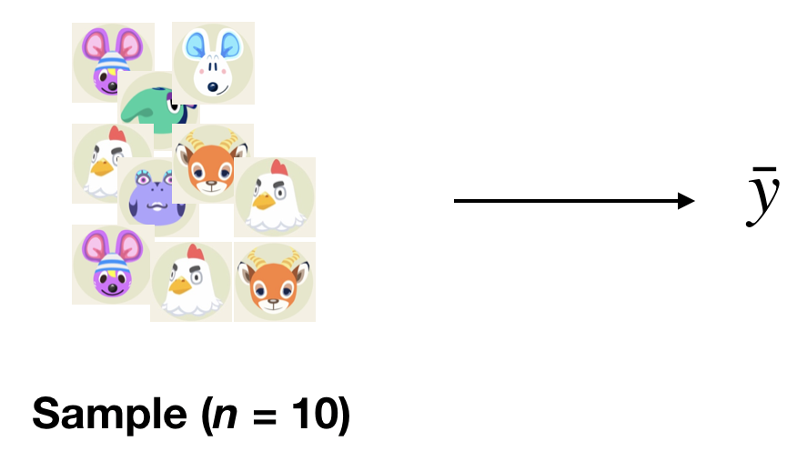
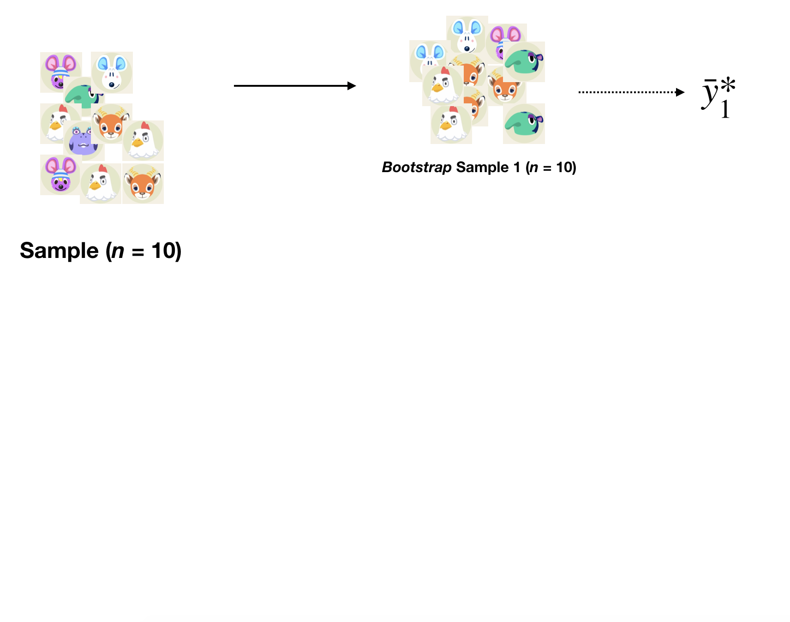
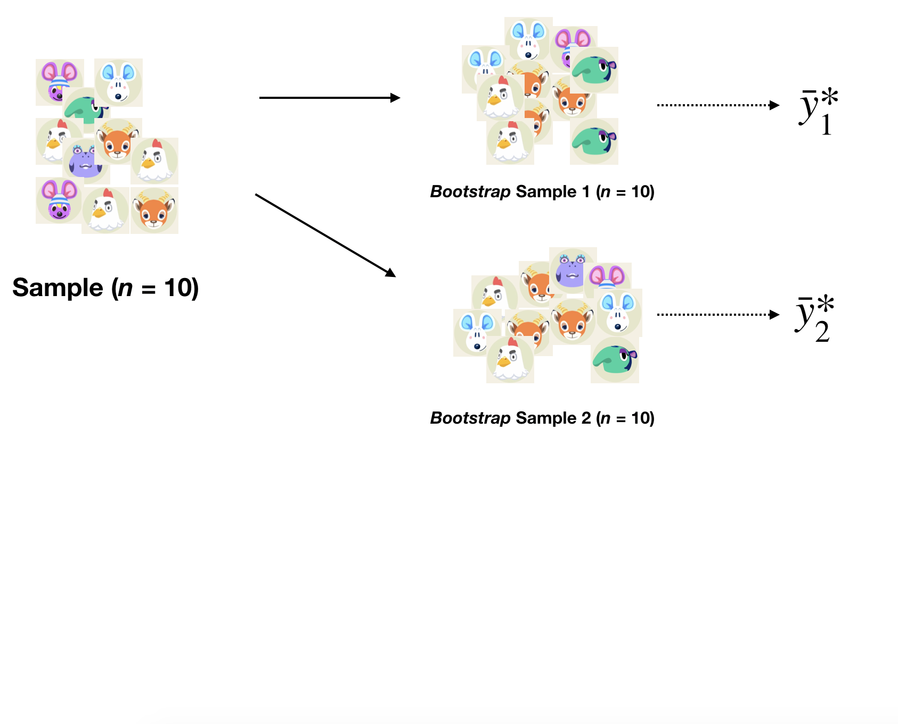
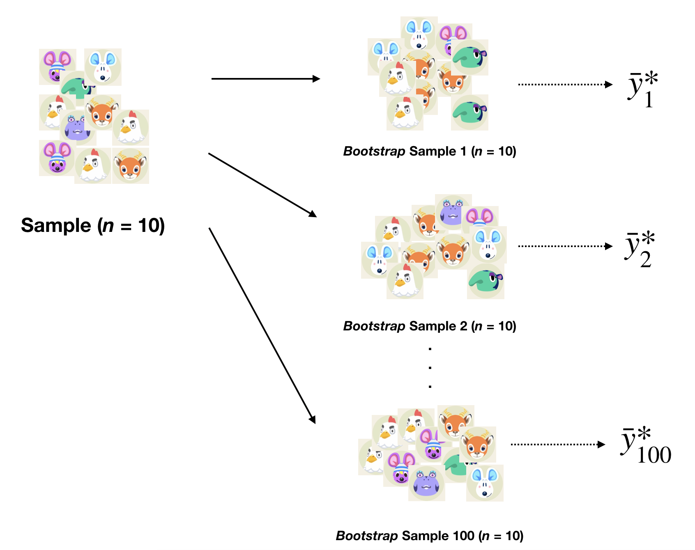
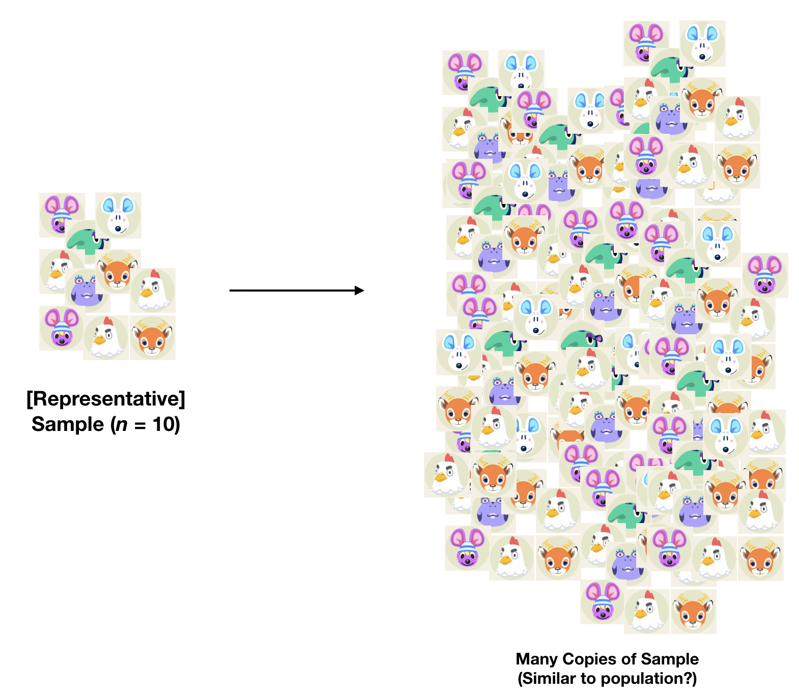
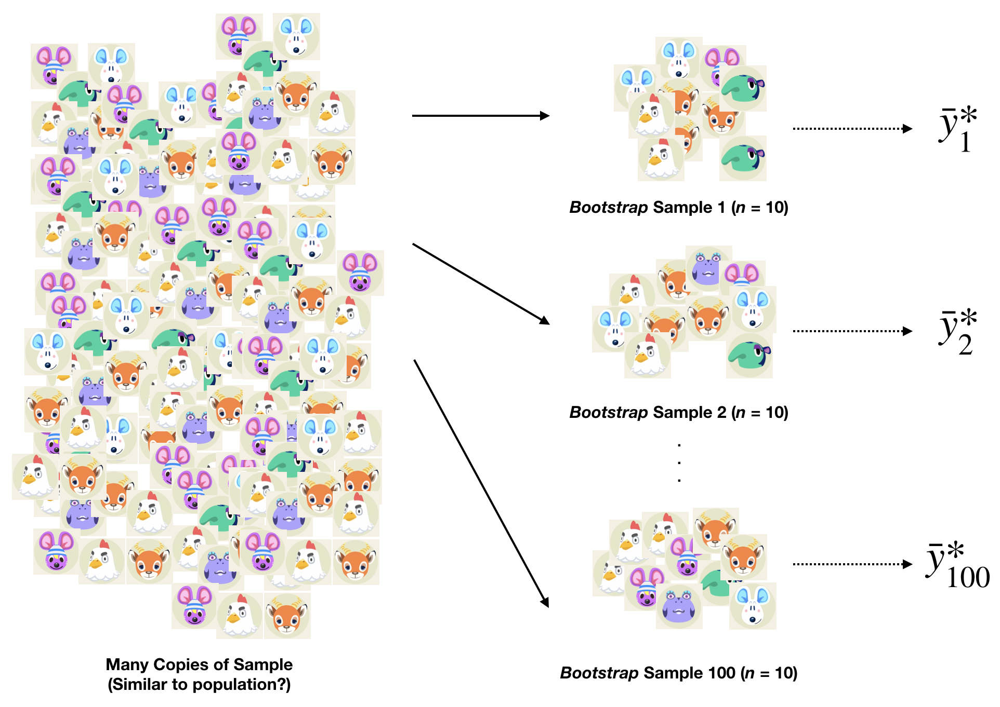

```{r xaringan-themer, include = FALSE}
library(xaringanthemer)
library(xaringanExtra)

mono_accent(base_color = "#5E5E5E") #3E8A83?
options(htmltools.preserve.raw = FALSE)

# collapseoutput.js from https://gist.github.com/emitanaka/eaa258bb8471c041797ff377704c8505#file-collapseoutput-js
```

```{r xaringan-panelset, echo=FALSE}
xaringanExtra::use_panelset()
```

```{r, echo = FALSE}
knitr::opts_chunk$set(
  message = FALSE, warning = FALSE
)
```

```{r, include = FALSE}
library(tidyverse)
library(mosaic)
library(bayesrules)

theme_set(theme_minimal() +
  theme(axis.title.x = element_text(size = 14, face = "bold"), 
        axis.title.y = element_text(size = 14, face = "bold"),
        axis.text.x = element_text(size = 12, face = "bold"), 
        axis.text.y = element_text(size = 12, face = "bold"), 
        plot.title = element_text(size = 16, face = "bold")))
```

<!--
pagedown::chrome_print("~/Dropbox/Teaching/03-Simmons Courses/STAT338-Probability Theory/Slides/06-Functions_RVs/06-Functions_RVs.html")
-->

class: center, middle, frame

# Bootstrap Sampling Distributions

---

# Comparing Approaches

One of the *major goals* of statistical inference is to understand how **variability** in samples can affect estimation. 

The two major approaches we've studied so far take different approaches to understanding **variability**. 

--

**1**. **Bayesian**

- Focus was on the variability of the **parameter**, conditional on the data: $\theta\mid\mathbf{y}$

.pull-left[
[*Moose pic to fill space* 👇]

```{r, echo = FALSE, out.width = "75%"}

```
]

.pull-right[
[*Moose pic to fill space* 👇]

```{r, echo = FALSE, out.width = "75%"}

```
]

---

# Comparing Approaches

One of the *major goals* of statistical inference is to understand how **variability** in samples can affect estimation. 

The two major approaches we've studied so far take different approaches to understanding **variability**. 

**2**. **Frequentist**

- Focus was on the variability of the **statistic**/estimator of the *parameter*

- If we know the distribution/population from which the data are sampled, $f(y\mid\theta)$, we can *simulate* samples from this distribution to see firsthand how they vary. 

- If the population is **normal** and the statistics are "nice" (e.g., sample mean, variance, proportion), we can use sampling distribution theory with the $\chi^{2}$ and $t$ distributions. 

- If the sample size $n$ is large and we're using $\bar{Y}$, we can use the **Central Limit Theorem**

---

# Sampling with Replacement

The *nonparametric* **bootstrap** involves randomly sampling data **with replacement** to form a "new" sample. 

- This "new" sample is referred to as a **bootstrap sample**. 

--

In other words, if we observe $n$ observations $\mathbf{y}=\{y_{1},\dots,y_{n}\}$, a **bootstrap sample** consists of the new set of observations $$\mathbf{y}^{*}=(y_{1}^{*},\dots,y_{n}^{*}).$$ 

- Each $y_{i}^{*}$ is *independently* sampled from the original $\mathbf{y}$ with *equal probability*: $$P(y_{i}^{*}=y_{j})=\frac{1}{n},\ \text{for all}\ i,j$$

--

```{r}
set.seed(339) # Use for reproducibility!
pet_names = c("Moose", "Cannoli", "Ralph", "Oscar", "Frank")
sample(pet_names, size = 5, replace = TRUE)
```

---

# Need for the Bootstrap

**Example 1**: If $Y_{1},\dots,Y_{n}\sim iid\ N(\mu,\sigma^{2})$, then $$\bar{Y}\sim N\left(\mu,\frac{\sigma^{2}}{n}\right)$$

**Example 2**: If $Y_{1},\dots,Y_{n}\sim iid\ F(\cdot)$ (i.e., the distribution that generated the data is *unknown*), then $\text{median}(\mathbf{y})\sim$ 🤷

--

For many statistics, there is no theoretical result for an **exact** sampling distribution, and *large-sample* approximations often require assumptions and knowledge that we just won't have with real data. 

- The **bootstrap** can help us *approximate* **sampling distributions** of statistics in these situations!

---

# The Bootstrap Procedure

**Setting**: We observe an *iid* sample $\mathbf{y}=\{y_{1},\dots,y_{n}\}$ from some distribution $F(\cdot)$, where $(\cdot)F$ is not necessarily known. 

- Suppose that $\theta$ is our *parameter* of interest, and $\hat{\theta}=T(\mathbf{y})$ is the statistic used to *estimate* $\theta$. 

The **bootstrap** proceeds as follows:

1. *Independently* sample $y_{i}^{*}$ **with replacement** from $\{y_{1},\dots,y_{n}\}$, for $i=1,\dots,n$. 

2. Calculate $\hat{\theta}^{*}=T(\mathbf{y}^{*})$, where $\mathbf{y}^{*}$ is the set of $n$ *resampled* observations. 

3. Repeat steps 1 and 2 $B$ times (usually 10,000) to form the **bootstrap distribution** of $\hat{\theta}$. 

4. Run `beepr::beep(8)` with volume **ON**. 

---

```{r, echo = FALSE, eval = FALSE}
# The Bootstrap

If the distribution from which the data are sampled, $f(y\mid\theta)$, is **unknown** and the statistic is *arbitrary*/not "nice" (e.g., the *sample median*), we can use the **bootstrap**. 

--

**Notation**: Let $\theta$ be our *target* parameter, and let $\hat{\theta}$ be a *point estimator* of $\theta$. 

- *Ideally*, we could take **many** (e.g., *B*) samples of size $n$ from the population to create a **sampling distribution** for $\hat{\theta}$. 
- If we take the average of the $\hat{\theta}$ created from each sample, $$\hat{\theta}^{*}=\frac{1}{B}\sum_{i=1}^{B}\hat{\theta}_{i}$$ would provide our *best guess* for $\theta$. 

- Importantly, we could also estimate the **variability** in $\hat{\theta}$: $$SE(\hat{\theta})=\sqrt{\frac{1}{B-1}\sum_{i=1}^{n}(\hat{\theta}_{i}-\hat{\theta}^{*})^{2}}$$

---
```

# Bootstrapping

A **bootstrap sample** is a sample taken from the **SAMPLE** **with replacement**. 

- After an observation is randomly selected for inclusion in the bootstrap sample, it can be randomly selected *again*.

[(Boehmke and Greenwell, 2020)](https://bradleyboehmke.github.io/HOML/)

.center[
```{r, echo = FALSE, dpi = 300}
knitr::include_graphics("bootstrap.png")
```
]


**Two Rules**:

1. A **bootstrap sample** must be the *same size as the original sample*. 

2. A **bootstrap sample** must contain only the observations that were included in the original sample. 

---

# Bootstrapping

When using the bootstrap, it might help to think of our original sample *as if* it were the population. 

- If the sample is *representative*, then the population might as well just be tons of copies of the original sample. 

--

**Example**:

Meet some "data":
.center[
```{r, echo = FALSE, dpi = 300}


```
]

---

# How Bootstrapping Works

**One Sample** $\implies$ *One Sample Statistic*

.center[
```{r, echo = FALSE, dpi = 300}

```
]

---

# How Bootstrapping Works

**One Sample** $\implies$ **Bootstrap Sample** $\implies$ *Bootstrap Statistic*

.center[
```{r, echo = FALSE, dpi = 300}

```
]

---

# How Bootstrapping Works

**One Sample** $\implies$ **Bootstrap Samples** $\implies$ *Bootstrap Statistics*

.center[
```{r, echo = FALSE, dpi = 300}

```
]

---

# How Bootstrapping Works

**One Sample** $\implies$ **Many Bootstrap Samples** $\implies$ *Many Bootstrap Statistics*

.center[
```{r, echo = FALSE, dpi = 300}

```
]

---

# Why Bootstrapping Works

If the sample is **representative**, the *population* might as well be *many copies of the sample*. 

.center[
```{r, echo = FALSE, dpi = 300}

```
]

---

# Why Bootstrapping Works

If the sample is **representative**, the *population* might as well be *many copies of the sample*. 

.center[
```{r, echo = FALSE, dpi = 300}

```
]

---

# Bootstrap Logic

**Recall**: The **sampling distribution** of an estimator $\hat{\theta}$ represents the distribution of values of $\hat{\theta}$ that we would observe if we took *many samples* from a population. 

The bootstrap treats the **observed** sample $\mathbf{y}=\{y_{1},\dots,y_{n}\}$ as if it were the *true population*. 

- Thus we're able to *approximate* the **sampling distribution** of $\hat{\theta}$ by observing the distribution of values of $\hat{\theta}^{*}$ obtained from many *bootstrap samples*. 

--

This relies *heavily* on our sample being a *solid representation* of the *true population*. 

- Usually okay if $n$ is **large**, but not as likely for small $n$. 

---

# Bootstrap Notation

Let $\hat{\theta}^{*}_{b}$ be the calculated *statistic* of interest from the *b*th bootstrap sample. The *mean* of our **bootstrap distribution** is: $$\bar{\theta}^{*}=\frac{1}{B}\sum_{b=1}^{B}\hat{\theta}^{*}_{b},$$ and we estimate the **standard error** with $$\hat{SE}_{B}^{*}=\sqrt{\frac{1}{B-1}\sum_{b=1}^{B}(\hat{\theta}^{*}_{b}-\bar{\theta}^{*})^{2}}$$

- **Note**: The bootstrap helps us approximate the **shape**, and **spread** of the *sampling distribution*, NOT the **center**. 
    - The *bootstrap distribution* should be centered around $\hat{\theta}$, the statistic from our original sample. 

---

# Example (feat. Penguins)

Let's try to estimate the **mean** *body mass* (in grams) of *Chinstrap penguins*, using a sample of $n=68$ from Palmer Station in Antarctica.

.pull-left[
```{r, echo = FALSE}

```
]

.pull-right[
```{r, message = FALSE, warning = FALSE}
library(tidyverse)
library(palmerpenguins)
chinstrap_mass = penguins %>%
  filter(species == "Chinstrap") %>%
  pull(body_mass_g)

mean(chinstrap_mass)
```

- The *sample mean* is **3733.088 grams**. But because this is just *one observed statistic*, we cannot immediately tell how much it might vary from sample-to-sample. 
]

---

# Bootstrapping (feat. Penguins)

**Bootstrap Sample #1**

```{r}
bs_samp1 = sample(chinstrap_mass, replace = TRUE, size = 68)
mean(bs_samp1)
```

--

**Bootstrap Sample #2**

```{r}
bs_samp2 = sample(chinstrap_mass, replace = TRUE, size = 68)
mean(bs_samp2)
```

--

**Bootstrap Sample #3**

```{r}
bs_samp3 = sample(chinstrap_mass, replace = TRUE, size = 68)
mean(bs_samp3)
```

---

# Bootstrapping (feat. Penguins)

Instead of obtaining each bootstrap sample/mean one-by-one, let's obtain an entire **bootstrap distribution**!

```{r, out.width = "50%", dpi = 300, fig.width = 6, fig.height = 4}
set.seed(339)
chinstrap_bootstrap_dist = replicate(10000, {
  bs_samp = sample(chinstrap_mass, replace = TRUE, size = 68)
  mean(bs_samp)
})

hist(chinstrap_bootstrap_dist)
```

---

# Bootstrapping (feat. Penguins)

How might we estimate the **variability** between sample means?

- We calculate the **standard deviation** of bootstrap statistics with the **bootstrap standard error**!

```{r}
sd(chinstrap_bootstrap_dist)
```

---

class: center, middle, frame

# Bootstrap Confidence Intervals

---

# Bootstrap Recap

**Bootstrap Resampling**

1. For $b=1,\dots,B$:
    - Draw a *bootstrap sample* of size $n$ **with replacement** from the *observed data*. 
    - Calculate the estimate $\hat{\theta}_{b}$ based on that bootstrap sample. 
    
2. The **bootstrap distribution** of estimates $\{\hat{\theta}_{1},\dots,\hat{\theta}_{B}\}$ approximates the *sampling distribution* of $\hat{\theta}$. 

<br>

🚨The bootstrap distribution does **NOT** reproduce the *mean* of the actual sampling distribution!

- It *does* reproduce the **shape**, **variance**, and **bias** of the actual sampling distribution. 

---

# Bootstrap Percentile CIs

If we have already constructed a **bootstrap distribution**, then one way to obtain a *confidence interval* using the bootstrap is fairly straightforward. 

- The interval between the $\alpha/2$ and $1-\alpha/2$ quantiles of the bootstrap distribution forms a $(1-\alpha)\times100\%$ **bootstrap percentile confidence interval** for $\theta$: $$[\hat{\theta}^{*}_{\alpha/2}, \hat{\theta}^{*}_{1-\alpha/2}]$$

--

**Penguin Example**🐧

- 95% Bootstrap Percentile CI for **mean body mass**

```{r}
quantile(chinstrap_bootstrap_dist, 
         probs = c(0.025, 0.975))
```

---

# Bootstrap with Small Samples  

The bootstrap distribution (and resulting *percentile confidence intervals*) tend to be too narrow when working with **small samples**.

- Could result in **undercoverage**! 😨

Let's estimate the mean $\mu$ with a sample of $n=5$ from a **Normal(339, 15<sup>2</sup>)** population. 

--

**Bootstrap Percentile CI**

```{r}
set.seed(339) # Use for reproducibility

norm_small_samp = rnorm(n = 5, mean = 339, sd = 15)

norm_boot_dist = replicate(10000, {
  boot_samp = sample(norm_small_samp, size = 5, replace = TRUE)
  mean(boot_samp)
})

quantile(norm_boot_dist, 
         probs = c(0.025, 0.975))
```

---

# Ordinary t-interval with Small Samples

The bootstrap distribution (and resulting *percentile confidence intervals*) tend to be too narrow when working with **small samples**.

- Could result in **undercoverage**! 😨

Let's estimate the mean $\mu$ with a sample of $n=5$ from a **Normal(339, 15<sup>2</sup>)** population. 

**Ordinary t-interval**

```{r}
x_bar = mean(norm_small_samp)
s = sd(norm_small_samp)
t_star = qt(0.975, df = 4)

c(x_bar - t_star*s/sqrt(5), 
  x_bar + t_star*s/sqrt(5))
```


```{r, echo = FALSE, eval = FALSE}
exp_samp = rexp(n = 7, rate = 1/2)

exp_samp_dist = replicate(10000, {
  exp_samp = rexp(n = 7, rate = 1/2)
  mean(exp_samp)
})

quantile(exp_samp_dist, 
         probs = c(0.025, 0.975))

mean(exp_samp) - qt(0.975, df = 6)*(sd(exp_samp)/sqrt(7))
```

---

# Bootstrap with Skewed Samples  

One of the primary uses of bootstrap resampling is in scenarios where it is difficult (or impractical, depending on how the data are stored) to derive formulas. 

- Another use is when assumptions for classical inference procedures are **not met**. 

**Example**: Estimate the variance of a right-skewed population. 

--

First, let's import $n=23$ Verizon repair times from [Hesterberg (2015)](https://www.tandfonline.com/doi/full/10.1080/00031305.2015.1089789?scroll=top&needAccess=true)

```{r}
library(resample) # Install for access to 'Verizon' data!
data("Verizon")
CLEC = with(Verizon, Time[Group == "CLEC"])
```

---

# Bootstrap with Skewed Samples 

The *sample variance* is $s^{2}=380.4$

```{r}
var(CLEC)
```

--

First, let's construct a 95% CI using the **"classical", normal-based procedure**: $$\left(\frac{(n-1)S^{2}}{\chi^{2}_{1-(\alpha/2)}}, \frac{(n-1)S^{2}}{\chi^{2}_{\alpha/2}}\right)$$

--

We obtain a 95% CI of $(227.5, 762.0)$. How does this compare to a **bootstrap CI**?

---

# Bootstrap with Skewed Samples 

```{r}
var_boot = replicate(10000, {
  boot_samp = sample(CLEC, size = 23, replace = TRUE)
  var(boot_samp)
})
quantile(var_boot,
         probs = c(0.025, 0.975))
```

This is...quite a bit different. But we had to make a *key assumption* with using the normal-based procedure:

.center[
**Our sample froms from a NORMAL population!**
]

--

For distributions with *extreme skew* (i.e., long tails), the actual variance of $S^{2}$ is much greater than fo Normal distributions. 