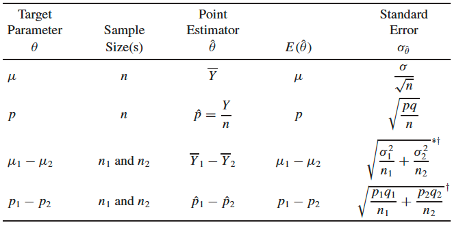
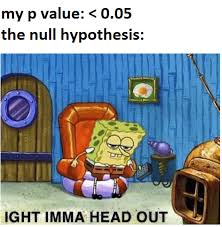

```{r xaringan-themer,  include = FALSE}
library(xaringanthemer)
library(xaringanExtra)

mono_accent(base_color = "#5E5E5E") #3E8A83?
options(htmltools.preserve.raw = FALSE)

# collapseoutput.js from https://gist.github.com/emitanaka/eaa258bb8471c041797ff377704c8505#file-collapseoutput-js
```


```{r,  echo = FALSE}
knitr::opts_chunk$set(
  message = FALSE,  warning = FALSE
)
```

```{r,  include = FALSE}
library(tidyverse)
library(mosaic)

theme_set(theme_minimal() +
  theme(axis.title.x = element_text(size = 14,  face = "bold"),  
        axis.title.y = element_text(size = 14,  face = "bold"), 
        axis.text.x = element_text(size = 12,  face = "bold"),  
        axis.text.y = element_text(size = 12,  face = "bold"),  
        plot.title = element_text(size = 16,  face = "bold")))
```

<!--
pagedown::chrome_print("~/Dropbox/Teaching/03-Simmons Courses/STAT339-Statistical Theory/Slides/06-Testing_Freq/06-Testing_Freq.html")
-->

class: center,  middle,  frame

# Elements of a Statistical Test

---

# Introduction

**Objective**: Make *inferences* about unknown **population parameters**

- Based on information contained in *sample data*

We can **estimate** the parameter using,  for example,  **point** or **interval** estimation. 

- We can also **test specific claims about the parameter**. 

--

<br>

A (Frequentist) **statistical hypothesis test** involves four components:

1. Null hypothesis,  $H_{0}$

2. Alternative hypothesis,  $H_{A}$

3. Test statistic

4. Rejection region

---

# My Awesome Function

I wrote an **R function** called `generateCat` that returns either "*Moose*" or "*Cannoli*". You don't know anything else about it. 

> I claim that this function returns "*Moose*" 50% of the time. 

> **Do you trust me**?<sup>1</sup>

<br>

```{r,  echo = FALSE}
generateCat = function(n){
  samp = sample(c("Moose",  "Cannoli"),  size = n,  
                replace = TRUE,  prob = c(0.65,  0.35))
  data.frame(n = n,  
             Moose_count = sum(samp == "Moose"),  
             Moose_prop = sum(samp == "Moose")/n)
}
set.seed(339)
```


.details[
```{r}
generateCat(n = 20)
```
]

.footnote[[1] No,  you definitely don't trust me. You believe the "Moose" proportion,  *p*,  is *higher* than 50%.]

---

# Null and Alternative Hypothesis

Because you **do not believe me** when I claim that the "Moose" proportion is 50%,  you might seek to support the *research hypothesis* that the "Moose" proportion is *higher* than 50%. 

- This research hypothesis is commonly known as the **alternative hypothesis**. 

--

<br>

Support for the *alternative hypothesis* is obtained by showing (using **sample data** as *evidence*) that the **null hypothesis** is false. 

- The **null hypothesis** is the *converse* of the **alternative hypothesis**:
    - $H_{0}:p = 0.5$
    - $H_{A}: p > 0.5$

Our research objective is to show whether the **data** support rejecting the *null* hypothesis in favor of the *alternative*. 

---

# Test Statistic

In order to decide between the null and alternative hypothesis,  we need **data**. 

- The **test statistic** (similar to an *estimator*) is a function of the **sample data**,  $Y_{1}, \dots, Y_{n}$. 

--

```{r,  echo = FALSE}
set.seed(339)
```

<br>

```{r}
generateCat(n = 20)
```

<br> 

A **test statistic** for this test is $Y=11$. This is the number of times `generateCat` returned "Moose".

- Our *statistical decision* will be based on this test statistic. 

---

# Rejection Region

The **rejection region** (*RR*) specifies the values of the *test statistic* for which the null hypothesis is to be *rejected* in favor of the alternative hypothesis. 

- We **reject the null hypothesis**,  *in favor of the alternative*,  if a particular sample yields a test statistic that falls in the RR. 

- If the value of the test statistic does *not* fall into the RR,  we **fail to reject the null hypothesis**. 

--

In our example,  larger values of $Y$ would lead us to reject $H_{0}$. 

- For example,  one RR might be the set of all values of $Y\geq16$: $$RR=\{y:y\geq 16\}$$

But is this a *good* rejection region? It's clear that larger values of $Y$,  say $\mathbf{y\geq k}$ are more contradictory to $H_{0}:p=0.5$,  but how should we choose $k$?

---

# Errors in Hypothesis Testing

For *any* rejection region,  two types of errors can be made in reaching a decision for our test:

- **Type I Error**: Reject $H_{0}$ when $H_{0}$ is true.
    - The *probability of a type I error* is denoted by $\alpha$,  which is also called the **level** of the test. 

- **Type II Error**: Fail to rejcet $H_{0}$ when $H_{A}$ is true. 
    - The *probability of a type II error* is denoted by $\beta$. 
    

Clearly,  we don't want to make incorrect decisions! 

- Because $\alpha$ and $\beta$ measure the risks associated with the two possible *incorrect* decisions we might reach,  they can help us find a "good" **rejection region**. 

---

# Type I Error

In our example,  I ran `generateCat` $n=20$ times. 

We wish to test $$H_{0}:p = 0.5\quad\text{versus}\quad H_{A}:p> 0.5$$ where $p$ is the *true* proportion of times this function is supposed to return "Moose". 

- The **test statistic** is $Y$,  the number of sampled times that `generateCat` returned "Moose". 

- Let's find $\alpha$,  using $RR=\{y\geq 16\}$. 

--

\begin{align*}
\alpha &= P(\text{type I error})=P(\text{reject}\ H_{0}\ \text{when}\ H_{0}\ \text{is true})\\
&=P(\text{value of test statistic is in RR when}\ H_{0}\ \text{is true})\\
&=P(Y\geq 16\mid p =0.5)
\end{align*}

--

```{r}
1 - pbinom(15,  size = 20,  prob = 0.5) # P(Y >= 16 | p = 0.5)
```

---

# Type II Error

Using $RR=\{y\geq 16\}$,  is our test equally good in protecting us from type II error?

- That is,  do we have low risk of concluding that the "Moose" proportion is equal to 50% when in fact it is *greater*?

--

\begin{align*}
\beta&=P(\text{type II error})=P(\text{fail to reject}\ H_{0}\ \text{when}\ H_{A}\ \text{is true})\\
&=P(\text{value of test statistic is NOT in RR when}\ H_{A}\ \text{is true})\\
&=P(Y<16\mid p = 0.6)
\end{align*}

- **Note**: We used $p=0.6$ as a particular value of $p$ that satisfies $H_{A}$. 

```{r}
pbinom(15,  size = 20,  p = 0.6)
```

---

# Type I and II Error

When using $RR=\{y\geq 16\}$...

- $\alpha = 0.006$ (low risk of type I error)

- $\beta = 0.949$ when $p = 0.6$ (high risk of type II error)

--

We can balance $\alpha$ and $\beta$ by enlarging the RR. Suppose instead we used: $$RR=\{y \geq 13\}$$

.pull-left[
```{r}
1 - pbinom(12,  size = 20,  p = 0.5)
```

- $\alpha=0.132$
]

--

.pull-right[
```{r}
pbinom(12,  size = 20,  p = 0.6)
```

- $\beta = 0.584$
]

--

<br>

💡**Better solution**: **Fix α, increase the sample size**!!!

---

class: center,  middle,  frame

# Common Large-Sample Tests

---

# Introduction

**Goal**: Test a set of *hypotheses* concerning a parameter $\theta$,  based on a *random sample* $Y_{1}, Y_{2}, \dots, Y_{n}$. 

**Setting**: Hypothesis testing based on an estimator $\hat{\theta}$ that has (approximately) a normal sampling distribution with mean $\theta$ and *standard error* $\sigma_{\hat{\theta}}$. 

- That is,  $$\hat{\theta}\sim N(\theta, \sigma_{\hat{\theta}})$$

--

Our **large-sample tests** will be based on the *large-sample estimators* from earlier this semester:

- $\bar{Y}$

- $\hat{p}$

- $\bar{Y}_{1}-\bar{Y}_{2}$

- $\hat{p}_{1}-\hat{p}_{2}$

---

# Large-Sample Estimators

(From WMS,  page 397)

.center[
```{r,  echo = FALSE,  dpi = 300,  out.width = "75%"}

```
]

---

# Setting Up The Test

Suppose we wish to test $$H_{0}:\theta=\theta_{0}\quad\text{versus}\quad H_{A}:\theta > \theta_{0}$$ where $\theta_{0}$ is a specific value of $\theta$.

- If **in reality** $\theta>\theta_{0}$,  then $\hat{\theta}$ is *more likely* to be large. 
    - In this case,  larger values of $\hat{\theta}$ favor rejection of $H_{0}$.
    
--
    
The **components of our statistical hypothesis test** are as follows:

1. **Null Hypothesis**:  $H_{0}:\theta=\theta_{0}$

2. **Alternative Hypothesis**: $H_{A}:\theta>\theta_{0}$

3. **Test Statistic**: $\hat{\theta}$

4. **Rejection Region**: $RR=\{\hat{\theta}>k\}$ for some choice of $k$

---

# The Rejection Region

To determine $k$ in the **rejection region**,  we'll fix the **type 1 error** probability $\alpha$ (the **level** of the test) and choose $k$ accordingly. 

- $\alpha=P(\text{type I error})=P(\text{reject}\ H_{0}\ \text{when}\ H_{0}\ \text{is true})=0.05$ (usually)


**WMS Figure 10.3** (page 496)
.center[
```{r,  echo = FALSE}
knitr::include_graphics("wms_fig_10_3.png")
```

]

---

# The Rejection Region

Remember,  $\theta$ is fixed but **unknown**. 

- But *when* $H_{0}$ *is true*,  $\theta=\theta_{0}$,  and by the **Central Limit Theorem**,  $$\hat{\theta}\sim N(\theta_{0}, \sigma_{\hat{\theta}})\iff Z=\frac{\hat{\theta}-\theta_{0}}{\sigma_{\hat{\theta}}}\sim N(0, 1)$$


Therefore,  an equivalent rejection region would be $$RR=\left\{\hat{\theta}:Z=\frac{\hat{\theta}-\theta_{0}}{\sigma_{\hat{\theta}}}>z_{\alpha}\right\}, $$ where $P(Z>z_{\alpha})=\alpha$

---

# Large-Sample (right tailed) Test

A **large-sample test**,  with *level* $\alpha$,  is as follows:

1. **Null Hypothesis**:  $H_{0}:\theta=\theta_{0}$

2. **Alternative Hypothesis**: $H_{A}:\theta>\theta_{0}$

3. **Test Statistic**: $Z=\frac{\hat{\theta}-\theta_{0}}{\sigma_{\hat{\theta}}}$

4. **Rejection Region**: $RR=\{z>z_{\alpha}\}$ (*upper-tail rejection region*)

--

**Example**

The *level* of our test is $\alpha=0.05$. 

- This means $RR=\{z>z_{0.05}\}$:
    ```{r}
    qnorm(0.05,  lower.tail = FALSE)
    ```
    
---

# My Awesome Function

I wrote an **R function** called `generateCat` that returns either "*Moose*" or "*Cannoli*". You don't know anything else about it. 

> I claim that this function returns "*Moose*" 50% of the time. 

> You don't trust me and *definitely* think it's higher. Test this hypothesis using an $\alpha=0.05$ level.

```{r,  echo = FALSE}
generateCat = function(n){
  samp = sample(c("Moose",  "Cannoli"),  size = n,  
                replace = TRUE,  prob = c(0.65,  0.35))
  data.frame(n = n,  
             Moose_count = sum(samp == "Moose"),  
             Moose_prop = sum(samp == "Moose")/n)
}
set.seed(339)
```

.display[
```{r}
generateCat(n = 40)
```
]

- $H_{0}:p=0.5$

- $H_{A}:p>0.5$

From our **sample**,  $n=40$ and $\hat{p}=0.6$. 

---

# The Null Distribution

Under $H_{0}$,  $p_{0}=0.5$,  and by the **Central Limit Theorem**,  $$Z=\frac{\hat{p}-p_{0}}{\sqrt{\frac{p_{0}(1-p_{0})}{n}}}\sim N(0, 1)$$ for **sufficiently large** $n$.

- **Note**: While we could've used $\sqrt{\hat{p}(1-\hat{p})/n}$ to *approximate* the standard error of $\hat{p}$,  we use $p_{0}$ because we are considering the distribution of $Z$ under $H_{0}$. 

--

- $RR=\{z>1.645\}$

- $Z=\frac{0.6-0.5}{\sqrt{\frac{0.5(1-0.5)}{40}}}=1.265$

--

**Decision**: *Fail to reject* $H_{0}$! At the $\alpha=0.05$ level,  the evidence does not support your decision to not trust me...

- Does this mean I'm telling the truth?! 😇

- Only time will tell... We need to calculate the probability of **type II error**,  $\beta$. 
    - This is the probability of accepting $H_{0}$ when $H_{A}$ is true. More on this later!

---

# Two-Tailed Tests

Suppose we wanted to test an alternative hypothesis of the form: $\theta\neq\theta_{0}$. 

- That is,  we're testing $H_{0}:\theta=\theta_{0}$ versus $H_{A}:\theta\neq\theta_{0}$

Our test statistic would remain the same! $$Z=\frac{\hat{\theta}-\theta_{0}}{\sigma_{\hat{\theta}}}$$

- The one thing that would change is the **rejection region**. That's because,  in this setting,  we'll reject $H_{0}$ if $\hat{\theta}$ is (a) much *smaller* or (b) much *larger* than $\theta_{0}$. 

.center[
```{r,  echo = FALSE}
knitr::include_graphics("wms_fig_10_4.png")
```
]

---

# Common Grounds

.pull-left[
I want to test whether the **mean** number of people in line at **Common Grounds** on a typical morning after STAT 339,  $\mu$,  is **different from** 5 people.

- For all I know,  the mean could be $<5$ or $>5$. Considering I can't even get the *name* right,  I don't know much else about Common Grounds...
]

.pull-right[
```{r,  echo = FALSE}
knitr::include_graphics("common_grounds.jpg")
```
]

I collect some **DATA** and obtain the following:

- $n=30$ (yes,  I checked the Common Grounds line for 30 mornings after STAT 339)

- $\bar{y}=6$ people in line,  with standard deviation $s=2$

> Do the data present sufficient evidence to suggest that the mean number of people in line at Common Grounds after STAT 339 is *different from* 5 people? Use $\alpha = 0.01$. 

---

# Summary

**Large-Sample** $\boldsymbol\alpha$**-Level Hypothesis Tests**

1. **Null Hypothesis**: $H_{0}$: $\theta=\theta_{0}$

2. **Alternative Hypothesis**: 
    - $H_{A}$: $\theta>\theta_{0}$ (upper-tail alternative)
    - $H_{A}$: $\theta<\theta_{0}$ (lower-tail alternative)
    - $H_{A}$: $\theta\neq\theta_{0}$ (two-tailed alternative)
    
3. **Test Statistic**: $Z=\frac{\hat{\theta}-\theta_{0}}{\sigma_{\hat{\theta}}}$

4. **Rejection Region**:
    - $\{z>z_{\alpha}\}$ (upper-tail RR)
    - $\{z<z_{\alpha}\}$ (lower-tail RR)
    - $\{|z|>z_{\alpha/2}\}$ (two-tailed RR)
    
---

class: center,  middle,  frame

# Type II Error Probabilities

---

# Type II Error

**Recall**: **Type II Error** occurs when you *fail to reject the null*,  when *the alternative is true*. 

For a test with $H_{0}:\theta=\theta_{0}$ versus $H_{A}:\theta > \theta_{0}$,  we can calculate type II error probabilities *only for specific values of* $\theta$ in $H_{A}$. 

- For some *specific alternative*,  $\theta=\theta_{A}$,  the *probability* of type II error,  $\beta$,  is 

\begin{align*}
\beta&=P(\hat{\theta}\ \text{is not in RR when}\ H_{A}\ \text{is true})\\
&=P(\hat{\theta}\leq k\mid \theta=\theta_{A})\\
&=P\left(\frac{\hat{\theta}-\theta_{A}}{\sigma_{\hat{\theta}}}\leq \frac{k-\theta_{A}}{\sigma_{\hat{\theta}}}\mid\theta=\theta_{A}\right), 
\end{align*}

--

By the **Central Limit Theorem**,  $Z=(\hat{\theta}-\theta_{A})/\sigma_{\hat{\theta}}\sim N(0, 1)$,  so we can calculate $$\beta=P\left(Z\leq \frac{k-\theta_{A}}{\sigma_{\hat{\theta}}}\mid\theta=\theta_{A}\right)$$ by finding a corresponding area under the $N(0, 1)$ curve,  using `pnorm()`.

---

# Type II Error Probability

In **My Awesome Function** example,  we had $n=40$ and $\hat{p}=0.6$. Let's find $\beta$ for a test of $$H_{0}:p=0.5\quad\text{versus}\quad H_{A}:p=0.65.$$

- From the example,  the **rejection region** for an $\alpha=0.05$ level test was $$z=\frac{\hat{p}-p_{0}}{\sqrt{\frac{p_{0}(1-p_{0})}{n}}}>1.645\iff \hat{p}>p_{0}+1.645\sqrt{\frac{p_{0}(1-p_{0})}{n}}.$$

- Plugging in $p_{0}=0.5$ and $n=40$,  we have the rejection region $\{\hat{p}>0.63\}$.

--

Therefore,  *by definition*,  the **type II error probability** is 

\begin{align*}
\beta&=P(\hat{\theta}\ \text{is not in RR when}\ H_{A}\ \text{is true})=P(\hat{p}\leq0.63\mid p=0.65)\\
&=P\left(Z\leq \frac{0.63-0.65}{\sqrt{\frac{0.65(1-0.65)}{40}}}\right)\\
&=P(Z\leq -0.265)=\boxed{0.396}
\end{align*}

---

# Understanding β

While we can only calculate $\beta$ for a *fixed* $p_{A}$,  we can visualize how $\beta$ depends on the *distance* between $p_{A}$ and $p_{0}$ (**0.5**). 

- If $p_{A}$ is far from $p_{0}$,  then the true value of $p$ is a bit easier to detect,  hence $\beta$ is much smaller. 

```{r,  echo = FALSE,  fig.align = "center",  dpi = 300,  fig.height = 4,  fig.width = 6,  out.width = "65%"}
alt_set = seq(0.5,  1,  by = 0.01)

beta = c()

for(i in 1:length(alt_set)){
  beta[i] = pnorm((0.63 - alt_set[i])/sqrt(alt_set[i]*(1-alt_set[i])/40))
}

gf_line(beta ~ alt_set,  size = 1.5) + 
  labs(y = expression(beta),  x = expression("p"["A"]))
```

---

# Back to Piéchart Emporium (yet again)

Piéchart Emporium claims that they pull in an average of 1000 dollars in *daily revenue*,  but you *definitely* think it's lower. To check this,  you could test $$H_{0}:\mu = 1000\quad\text{versus}\quad H_{A}:\mu<1000$$ at the $\alpha=0.05$ level,  using the **rejection region** $\{z < -1.645\}$ and the following observed data:

- $n=30$ days
- $\bar{y}=950$ dollars
- $s=80$ dollars

In *groups of 3*,  calculate $\beta$ for one of the following three specific values of $\mu$ under $H_{A}$:

1. $H_{A}: \mu=980$

2. $H_{A}: \mu=960$

3. $H_{A}: \mu=940$


---

# Understanding β

```{r,  echo = FALSE,  fig.align = "center",  dpi = 300,  fig.height = 4,  fig.width = 6,  out.width = "65%"}
alt_set = seq(900,  1000,  by = 0.1)

beta = c()

for(i in 1:length(alt_set)){
  beta[i] = 1-pnorm((975.97 - alt_set[i])/(80/sqrt(30)))
}

gf_line(beta ~ alt_set,  size = 1.5) + 
  labs(y = expression(beta),  x = expression(mu["A"]))
```

---

class: center,  middle,  frame

# p-values

.pull-left[
```{r,  echo = FALSE}

```
]

.pull-right[
```{r,  echo = FALSE}

```
]

---

# What is a p-value?

> **p-value**: The probability of observing a test statistic *at least as extreme* as the one you observed,  *if the null hypothesis is true*.
  
- In other words,  this is the *smallest* level of significance,  $\alpha$,  for which the observed data indicate that the null hypothesis should be rejected.

- The *smaller* the p-value becomes,  the **stronger** the evidence that the null hypothesis should be *rejected*. 

--

Typically,  we use p-values in the following way to reach decisions in a hypothesis test:

- $p\leq\alpha$: **Reject the null hypothesis**

- $p>\alpha$: **Fail to reject the null hypothesis**

🚨But be careful with this line of thinking! There is more to science than an *arbitrary*,  *binary* decision making process!

---

# My Awesome Function

In the `generateCat` example,  we tested $$H_{0}:p=0.5\quad\text{versus}\quad H_{A}:p>0.5$$using $n=40$ and $\hat{p}=0.6$. 

- Using $\alpha=0.05$,  our rejection region was $RR=\{z>1.645\}$,  and our *observed* test statistic was $$Z=\frac{0.6-0.5}{\sqrt{\frac{0.5(1-0.5)}{40}}}=1.265.$$

--

Under $H_{0}$,  $Z\sim N(0, 1)$,  so $$\text{p-value}=P(Z\geq 1.265\mid H_{0}\ \text{is true})=0.103$$

```{r}
1-pnorm(1.265)
```

---

# Common Grounds

.pull-left[
I want to test whether the **mean** number of people in line at **Common Grounds** on a typical morning after STAT 339,  $\mu$,  is **different from** 5 people.

- $H_{0}:\mu=5$

- $H_{A}:\mu\neq 5$
]

.pull-right[
```{r,  echo = FALSE}
knitr::include_graphics("common_grounds.jpg")
```
]

**Data**: $n=30$,  $\bar{y}=6$,  $s=2$

- Though rather than rejecting $H_{0}$ for *only* large values of $\bar{y}$,  we might also reject $H_{0}$ for *small* values of $\bar{y}$. When calculating the p-value,  we need to account for this!

---

# Common Grounds

Our **test statistic** for this test was $$Z=\frac{6-5}{2/\sqrt{30}}=2.74.$$

.pull-left[
```{r,  echo = FALSE,  dpi = 300,  fig.height = 4,  fig.width = 6}
ggplot(data = data.frame(x = c(-4,  4)),  aes(x)) +
  stat_function(fun = dnorm,  
                args = list(mean = 0,  sd = 1)) + 
  stat_function(fun = dnorm,  
                args = list(mean = 0,  sd = 1), 
                xlim = c(2.74,  4), 
                geom = "area",  
                fill = "hotpink") +
  stat_function(fun = dnorm,  
                args = list(mean = 0,  sd = 1), 
                xlim = c(-4,  -2.74), 
                geom = "area",  
                fill = "hotpink") +
  labs(x = "z",  y = "f(z)")
```
]

--

.pull-right[
The pink regions in the plot represent the **p-value** for a *two-tailed* test. 

**In R**:

```{r}
2*pnorm(2.74,  lower.tail = FALSE)
```
]

--

**Decision**: $p<0.05$,  so *reject the null hypothesis*. 

---

# Relationship with Confidence Intervals

(In my opinion) Confidence intervals are **more informative** and **less confusing** than p-values.

- *Not that p-values are useless; the definition just lends itself well to misinterpretation!*

There's also a *duality* that exists between large-sample CIs and *two-tailed* hypothesis tests:

- Do **not** reject $H_{0}:\theta=\theta_{0}$ at the $\alpha$ level if $\theta_{0}$ lies *inside* a $100(1-\alpha)\%$ confidence interval for $\theta$. 

- **Reject** $H_{0}$ if $\theta_{0}$ lies *outside* the interval. 

--

**Example** 

95% CI for the **mean** number of people in line at **Common Grounds** on a typical morning after STAT 339,  $\mu$: $$6\pm 1.96\times \frac{2}{\sqrt{30}}=(5.28,  6.72)$$

---

class: center,  middle,  frame

# Small-Sample Hypothesis Testing

## (for means)

---

# Introduction

The **large-sample** hypothesis testing procedures rely on the condition that the sample size is *large enough* that $$Z=\frac{\hat{\theta}-\theta_{0}}{\sigma_{\hat{\theta}}}\sim (approx)\ N(0, 1).$$

A common procedure that we can use with **small samples** relies on using the *t*-distribution as the sampling distribution of the **test statistic**. 

- This procedure,  the **t-test**,  *is only appropriate for samples from Normal populations*!

---

# The t-test

**Setting**

- $Y_{1}, Y_{2}, \dots, Y_{n}$ denote a **random sample** of size $n$ 

- The sample comes from a **Normal** distribution with *unknown* mean $\mu$ and *unknown* variance $\sigma^{2}$. 

**Procedure**

- Let $\bar{Y}$ and $S$ denote the sample mean and sample standard deviation,  respectively. 

- Under the **null hypothesis**,  $H_{0}:\mu=\mu_{0}$,  the *test statistic* $$T=\frac{\bar{Y}-\mu_{0}}{S/\sqrt{n}}\sim t(n-1).$$

- For $H_{A}:\mu>\mu_{0}$,  the **rejection region** is $RR=\{t>t_{\alpha}\}$. 
    - That is,  any value of $T$ such that $P(T>t_{\alpha})=\alpha$,  where $t_{\alpha}$ is the **upper** $\alpha$-quantile of the $t(n-1)$ distribution. 
    
---

# Florida Lobsters

.pull-left[
```{r,  echo = FALSE}

```
]

.pull-right[
**WMS 10.75**

A declaration by the Bahamian government that prohibits U.S. lobsterers from fishing on the Bahamian portion of the continental shelf was *expected* to dramatically reduce the landings (in pounds per lobster trap). 

According to records,  **the prior mean landings per trap was 30.31 pounds**. 
]

A *random sample* of **20 lobster traps** since the Bahamian fishing restriction went into effect gave the following results (in pounds):

\begin{align*}
&17.4, \ 18.9, \ 39.6, \ 34.4, \ 19.6, \ 33.7, \ 37.2, \ 43.4, \ 41.7, \ 27.5, \\
&24.1, \ 39.6, \ 12.2, \ 25.5, \ 22.1, \ 29.3, \ 21.1, \ 23.8, \ 43.2, \ 24.4
\end{align*}

Do these landings provide evidence that the mean landings per trap has **decreased**? Test using $\alpha=0.05$

---

# Comparing Groups

We can also use the *t*-distribution to **compare the means** of two Normal populations that possess *equal variances*. 

**Setting**

- *Independent* samples from *Normal* distributions with $\sigma_{1}^{2}=\sigma_{2}^{2}$.

**Hypotheses**

- $H_{0}:\mu_{1}-\mu_{2}=D_{0}$,  where $D_{0}$ is usually **0**.

- $H_{A}:\mu_{1}-\mu_{2}>D_{0}$ (or $<$ or $\neq$ depending on which alternative is appropriate)

---

# Comparing Groups

We can also use the *t*-distribution to **compare the means** of two Normal populations that possess *equal variances*. 

**Test Statistic**

- $T=\frac{(\bar{Y}_{1}-\bar{Y}_{2})-D_{0}}{S_{p}\sqrt{\frac{1}{n_{1}}+\frac{1}{n_{2}}}}$,  where $$S_{p}^{2}=\frac{(n_{1}-1)S_{1}^{2}+(n_{2}-1)S_{2}^{2}}{n_{1}+n_{2}-2}$$

**Rejection Region**

- For an *upper-tail alternative*,  $RR=\{t>t_{\alpha}\}$,  where $t_{\alpha}$ is the *upper* $\alpha$-quantile of the $t(n_{1}+n_{2}-2)$ distribution. 

---

# Is the sequel always better?

I watched **Shrek** recently,  because Netflix decided it was going to pull the movie at the end of April 2022. 

- Not sure yet what this means for **Shrek 2**,  and as of this writing I haven't watched it in a while. But let's compare them anyways!

.center[
```{r,  echo = FALSE,  out.width = "50%"}

```
]

Suppose random samples of $n_{1}=n_{2}=10$ critic reviews from *Metacritic* for each film yielded the ratings below. Check if the sequel is better at $\alpha=0.01$. 

- **Shrek**: $89.62,  82.03,  79.65,  88.20,  82.13,  86.06,  90.33,  89.44,  86.27,  79.82$

- **Shrek 2**: $77.05,  73.93,  76.27,  70.89,  79.65,  64.49,  67.39,  74.15,  71.50,  86.16$

---

# Connecting to Confidence Intervals

The connection between *two-tailed* **t-tests** and *small-sample confidence intervals* is similar to the duality between *large-sample* confidence intervals and tests!

- Do **not** reject $H_{0}:\mu=\mu_{0}$ if $\mu_{0}$ lies *inside* $\bar{y}\pm t_{\alpha/2}\times \frac{S}{\sqrt{n}}$

- **Reject** $H_{0}:\mu=\mu_{0}$ if $\mu_{0}$ lies *outside* $\bar{y}\pm t_{\alpha/2}\times \frac{S}{\sqrt{n}}$

- (Ditto for CIs for a **difference between means**)
    - *Reject* $H_{0}:\mu_{1}-\mu_{2}=D_{0}$ if $D_{0}$ lies *outside* the CI.

--

<br>

**Example**:

Calculate a 99% confidence interval for the *difference* in average Metacritic ratings between **Shrek** and **Shrek 2**. 

---

# t-tests in R

Because the **t-test** is a common hypothesis testing procedure,  it is supported by the **base R** `t.test()` function. 

For example,  we can repeat the *lobster* example in R using the following code:

```{r}
lobster_data = c(17.4, 18.9, 39.6, 34.4, 19.6, 33.7, 37.2, 43.4, 41.7, 27.5, 
                 24.1, 39.6, 12.2, 25.5, 22.1, 29.3, 21.1, 23.8, 43.2, 24.4)

t.test(lobster_data,  mu = 30.31, alternative = "less")
```

---

class: center, middle, frame

# Testing Hypotheses Concerning Variances

---

# Introduction

**Recall**: If $Y_{1},Y_{2},\dots,Y_{n}\sim N(\mu,\sigma^{2})$, where both $\mu$ and $\sigma^{2}$ are *unknown*, then $$\frac{(n-1)S^{2}}{\sigma^{2}}\sim \chi^{2}(n-1).$$

We can use this fact to test $H_{0}:\sigma^{2}=\sigma_{0}^{2}$ for some fixed value $\sigma_{0}^{2}$. 

--

If $H_{0}:\sigma^{2}=\sigma_{0}^{2}$ is *true*, then $$\chi^{2}\equiv\frac{(n-1)S^{2}}{\sigma^{2}_{0}}\sim \chi^{2}(n-1),$$and we can use $\chi^{2}$ as our **test statistic**. 

- For an $\alpha$-test of $H_{0}:\sigma^{2}=\sigma_{0}^{2}$ versus $H_{A}:\sigma^{2}>\sigma_{0}^{2}$, $$RR=\{\chi^{2}>\chi^{2}_{\alpha}\}$$

---

# Example

(**WMS 10.79**)

The manufacturer of a machine to package soap power claimed that their machine could load cartons at a given weight with a range of no more than 0.4 ounce. The mean and variance of a sample of $n=8$ three-pound boxes were found to equal 3.1 and 0.018, respectively. 

Test the hypothesis that the variance of the population of weight measurements is $\sigma^{2}=0.01$ against the alternative that $\sigma^{2}>0.01$. Use $\alpha=0.05$. 

---

# Comparing Groups

Sometimes rather than examining one group's variance, we might want to *compare* the variances of **two Normal distributions**.

- Usually to determine whether they are *equal*. 

--

From **Exam 2**: 

- If independent samples of size $n_{1}$ and $n_{2}$ are taken from two normally distributed populations with variances $\sigma_{1}^{2}$ and $\sigma_{2}^{2}$, respectively, then $$F=\frac{S_{1}^{2}/\sigma_{1}^{2}}{S_{2}^{2}/\sigma_{2}^{2}}\sim F(df_{1}=n_{1}-1, df_{2}=n_{2}-1)$$

--

Suppose we're testing $H_{0}:\sigma_{1}^{2}=\sigma_{2}^{2}$ versus $H_{A}:\sigma_{1}^{2}>\sigma_{2}^{2}$. Under $H_{0}$, $\sigma_{1}^{2}=\sigma_{2}^{2}$ and $$F=\frac{S_{1}^{2}/\sigma_{1}^{2}}{S_{2}^{2}/\sigma_{2}^{2}}=\frac{S_{1}^{2}}{S_{2}^{2}}\sim F(df_{1}=n_{1}-1, df_{2}=n_{2}-1)$$ is a **test statistic**!

---

# 90s Road Trip

Because the test statistic, $F$, follows an $F(n_{1}-1, n_{2}-1)$ distribution under the null hypothesis, a **rejection region** for an $\alpha$-level test comparing variances is $$RR=\{F>F_{\alpha}\},$$where $F_{\alpha}$ is the $\alpha$-quantile of the $F(n_{1}-1, n_{2}-1)$ distribution. 

--

**Example**

|                         | 90s Road Trip           | No Music           |
|-------------------------|:-----------------------:|:------------------:|
| Sample size, $n$        |           100           |        100         |
| Mean, $\bar{y}$         |          10.75          |       12.75        |
| Standard deviation, $s$ |            4            |         5          |

Using the data from **Exam 2**, is there sufficient evidence to conclude that the variance of *objects memorized* for the "No Music" group is *larger* than the variance for the "90s Road Trip" group?

